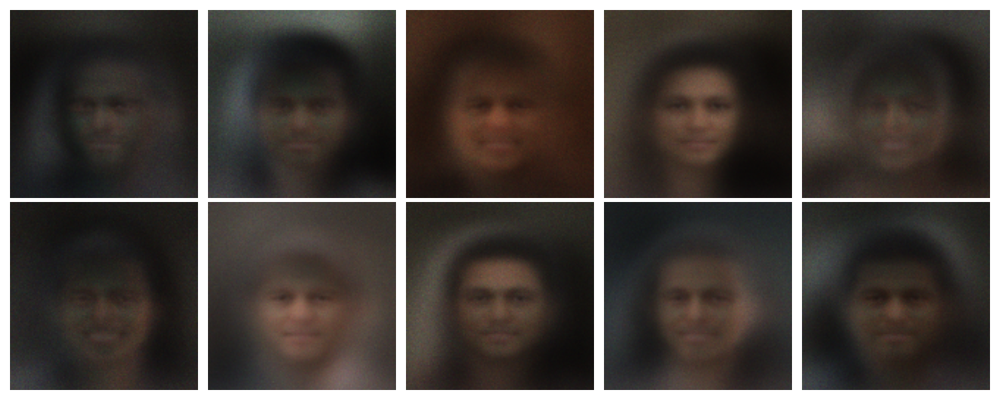

# Human Face Generation From Various ML Techniques

This project explores two popular generative models, Generative Adversarial Networks (GANs) and Variational Autoencoders (VAEs), for the task of generating human faces.

## Dataset

The models in this project are trained on the [CelebA dataset](http.mmlab.ie.cuhk.edu.hk/projects/CelebA.html). The images are resized to 128x128 pixels. The dataset should be placed in the `data/img_align_celeba` directory.

## Setup

To run the code in this project, you need to have Python and PyTorch installed. You can install the required libraries using pip:

```bash
pip install torch torchvision matplotlib tqdm
```

## Gradio Frontend

An interactive Gradio interface is provided in `web.py` so you can easily test and create your own samples

### Dependencies

Install the UI dependencies:

```bash
pip install gradio
```

### Run Locally

Start the frontend from the project root:

```bash
python web.py
```

Gradio will launch a local server and display a link in the terminal. Open the provided URL in your browser, pick either the VAE or GAN option, and click Generate to create a face sample.

## Generative Adversarial Network (GAN)

### Architecture

The GAN consists of a Generator and a Discriminator, both implemented as simple multi-layer perceptrons (MLPs) with LeakyReLU activation functions.

*   **Generator:** Takes a random noise vector as input and outputs a 128x128x3 image.
*   **Discriminator:** Takes an image as input and outputs a probability of the image being real.

### Training

To train the GAN model, run the `train.py` script in the `gan` directory:

```bash
python gan/train.py
```

The script will train the models and save checkpoints to the `gan/models/` directory.

### Inference

To generate new faces using a trained GAN model, run the `inference.py` script in the `gan` directory:

```bash
python gan/inference.py
```

This will load the `gan/models/generator.pth` model, generate 10 random faces, and save the results to `images/gan_results.png`

## Variational Autoencoder (VAE)

### Architecture

The VAE consists of an Encoder and a Decoder, both implemented as MLPs with LeakyReLU activation functions.

*   **Encoder:** Takes a 128x128x3 image as input and outputs the parameters (mean and log-variance) of a latent distribution.
*   **Decoder:** Takes a sample from the latent distribution and reconstructs a 128x128x3 image.

### Training

To train the VAE model, run the `train.py` script in the `vae` directory:

```bash
python vae/train.py
```

The script will train the model and save checkpoints to the `vae/models/` directory.

### Inference

To generate new faces using a trained VAE model, run the `inference.py` script in the `vae` directory:

```bash
python vae/inference.py
```

This will load the `vae/models/vae.pth` model, generate 10 random faces, and save the results to `images/vae_results.png`

## Results

Below are example results from approximatly 50 epochs of training on each model

**GAN Generated Faces:**


**VAE Generated Faces:**


